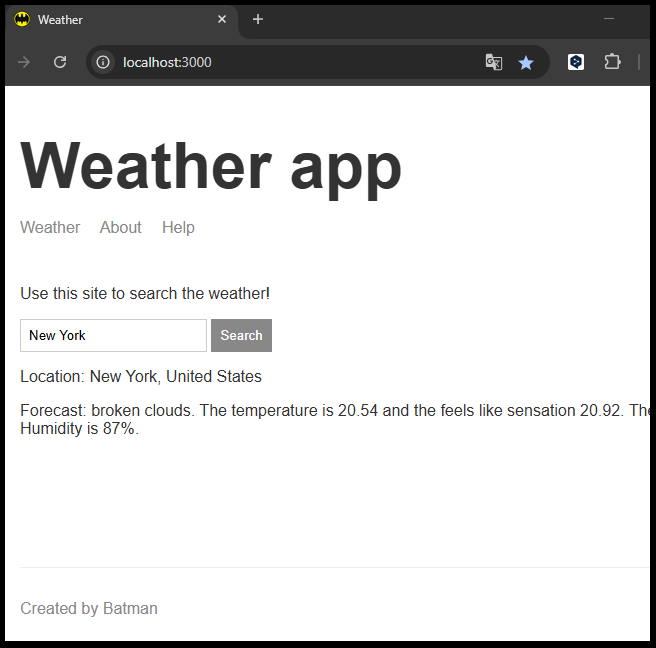

# ☁️ Weather App

Aplicación web que permite buscar el clima actual de cualquier lugar ingresando su dirección. Utiliza los servicios de Mapbox y Weatherstack para obtener geolocalización y datos meteorológicos.

## 🚀 Tecnologías utilizadas

- Node.js
- Express
- Handlebars (HBS)
- APIs externas:
  - [Geocode](https://geocode.maps.co/)
  - [Openweathermap](https://openweathermap.org/)

## 📸 Captura

## 🛠️ Instalación y uso local

1. Cloná el repositorio:   
    git clone https://github.com/ariascm/node3-weather-website.git
    cd node3-weather-website

2. Instalá las dependencias:
    npm install

3. Iniciá el servidor:
    npm start

4. Abrí en tu navegador:
    http://localhost:3000

## 📌 Funcionalidades

    *Búsqueda por dirección
    *Datos en tiempo real del clima (temperatura, sensación térmica, descripción)
    *Manejador de errores para direcciones inválidas
    *Diseño responsivo básico

## 🧩 Estructura del proyecto

    node3-weather-website/
    ├── public/
    ├── src/utils/        # Lógica de geolocalización y clima
    ├── views/            # Plantillas Handlebars
    ├── app.js
    ├── .env              # Variables privadas
    └── README.md

## 👤 Autor
Cristian Arias
GitHub - @ariascm
